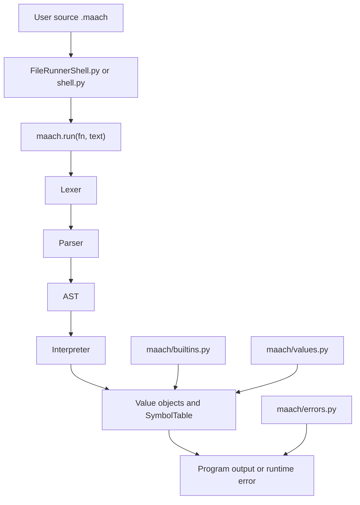

# MaachLang Technical Guide

## Purpose

This document explains how the MaachLang project works internally: how source code moves through the runtime, how values and scopes are represented, how control flow is evaluated, and how the command-line entrypoints connect to the interpreter.

The codebase is intentionally small. The implementation is split into a package under `maach/` plus a few thin top-level runners.

## Project Layout



At a practical level:

* `maach/core.py` wires the lexer, parser, interpreter, and built-ins together.
* `maach/lexer.py` turns raw text into tokens.
* `maach/parser.py` converts tokens into AST nodes.
* `maach/ast.py` defines the syntax tree node types.
* `maach/interpreter.py` walks the AST and produces runtime values.
* `maach/values.py` defines numbers, strings, lists, functions, and runtime flow helpers.
* `maach/builtins.py` registers constants and built-in functions.
* `maach/errors.py` formats syntax and runtime errors with source context.

## End-to-End Data Flow

The execution path for a program looks like this:

1. A shell script or Python caller passes a filename or raw source string into `maach.run(fn, text)`.
2. The lexer scans the text character by character and emits tokens.
3. The parser consumes tokens and builds an AST.
4. The interpreter evaluates the AST inside a `Context` with a `SymbolTable`.
5. Built-in constants and functions are resolved from the global symbol table.
6. Results are returned as runtime values or as structured errors.

The runtime always separates three concerns:

* Syntax handling: lexer and parser
* Evaluation: interpreter and runtime values
* Presentation: shell wrappers and error formatting

That separation is why the CLI entrypoints stay thin.

## Entry Points

### File Runner

`FileRunnerShell.py` is the non-interactive entrypoint. It:

* reads the target `.maach` file name from `sys.argv`
* prints a startup banner
* calls `run(filename, f'Maach("{filename}")')`
* prints either a runtime error or the final value

### Interactive Shell

`shell.py` is the REPL. It:

* prints a shell banner
* reads one line at a time from `input()`
* sends each line through `run("<ShellFile>", text)`
* exits on `tham` or `exit`

### Convenience Script

`maach.sh` switches between the two modes:

* no arguments runs `shell.py`
* a filename argument runs `FileRunnerShell.py`

## Runtime Core

### `maach/core.py`

`maach/core.py` is the public runtime composition layer.

It does four things:

1. imports the lexer, parser, interpreter, and symbol-table builder
2. creates a global symbol table
3. populates the symbol table with constants and built-ins
4. exposes `run(fn, text)` as the single execution API

The `run` function itself is intentionally linear:

```python
lexer = Lexer(fn, text)
tokens, error = lexer.make_tokens()
parser = Parser(tokens)
ast = parser.parse()
interpreter = Interpreter()
context = Context("<program>")
context.symbol_table = global_symbol_table
result = interpreter.visit(ast.node, context)
```

The output of `run` is always a pair:

* `(value, None)` on success
* `(None, error)` on failure

## Lexing

The lexer is responsible for turning characters into tokens.

### What It Recognizes

The current lexer supports:

* integers and floats
* strings with simple escapes like `\n` and `\t`
* identifiers and keywords
* arithmetic operators
* comparison operators
* parentheses and square brackets
* commas
* comments starting with `#`
* statement separators using either semicolons or newlines

### Token Model

Tokens carry:

* type
* optional value
* source position metadata

Position metadata is important because it powers precise error messages.

### Why This Matters

The lexer is the first place where source text becomes structured. Every later phase depends on the token stream being correct, so syntax issues are caught early and reported with file and line information.

## Parsing

The parser is a recursive descent parser. It converts the token stream into AST nodes that encode program structure.

### Main Parse Layers

The parser is organized by precedence:

* `expr()` handles variable declarations and boolean operators
* `comp_expr()` handles comparisons and unary `noy`
* `arith_expr()` handles `+` and `-`
* `term()` handles `*` and `/`
* `factor()` handles unary arithmetic
* `power()` handles exponentiation
* `call()` handles function calls
* `atom()` handles literals, identifiers, lists, control flow, and function definitions

### Statements and Blocks

Statements are separated by newlines or semicolons. Blocks are formed by multiple statements until a terminator such as `byass` is encountered.

That means MaachLang uses indentation for readability, but the parser itself relies on token structure, not whitespace indentation levels.

### AST Nodes

The AST node types in `maach/ast.py` correspond directly to language features:

* `NumberNode` and `StringNode` for literals
* `ListNode` for list literals
* `VarAccessNode` and `VarAssignNode` for variables
* `BinOpNode` and `UnaryOpNode` for expressions
* `IfNode`, `ForNode`, and `WhileNode` for control flow
* `FuncDefNode` and `CallNode` for functions
* `ReturnNode`, `ContinueNode`, and `BreakNode` for flow control

The parser does not execute anything. It only builds structure.

## Interpretation

The interpreter walks AST nodes and turns them into runtime values.

### Context and Scope

`Context` stores:

* a display name for error reporting
* a parent context for lexical nesting
* the parent entry position for tracebacks
* a symbol table for variables and built-ins

`SymbolTable` is a simple dictionary with parent chaining. Lookups fall back to the parent table when a name is not found locally.

### Node Evaluation

Key evaluation rules:

* literals become runtime `Number`, `String`, or `List` objects
* variable access reads from the current symbol table chain
* assignment writes into the current symbol table
* binary and unary operators delegate to runtime value methods
* `if` and loop nodes control branch selection and iteration
* function definitions create callable runtime function objects
* function calls evaluate arguments, then execute the target value

### Return, Break, and Continue

Control-flow statements do not directly return plain Python values. They are carried by `RTResult`, which tracks:

* the current value
* errors
* function returns
* loop break/continue state

This allows the interpreter to unwind nested evaluations without throwing Python exceptions for normal language control flow.

## Runtime Values

`maach/values.py` defines the runtime object model.

### Value Hierarchy

* `Value` is the base type
* `Number`, `String`, and `List` implement arithmetic and data operations
* `Function` represents user-defined MaachLang functions
* `BaseFunction` and `BuiltInFunction` handle callable behavior

### Operator Behavior

Instead of hard-coding all operator semantics in the interpreter, each value type implements methods such as:

* `added_to`
* `subbed_by`
* `multed_by`
* `dived_by`
* `powed_by`
* comparison methods
* logical methods such as `anded_by`, `ored_by`, and `notted`

This keeps type-specific behavior inside the type itself, which is easier to extend and reason about.

### Truthiness

Runtime truthiness is value-specific:

* `Number(0)` is falsey
* empty strings and empty lists are falsey
* non-zero numbers, non-empty strings, and non-empty lists are truthy

That behavior is used by `if`, `while`, and logical operators.

## Built-ins And Globals

`maach/builtins.py` populates the global symbol table with constants and native functions.

### Constants

* `khali` maps to null-like zero
* `bhul` maps to false
* `thik` maps to true
* `onko_pi` maps to π

### Built-in Functions

Typical built-ins include:

* printing values
* input handling
* list operations
* type checks
* utility helpers

Built-ins are implemented as runtime callable objects rather than direct interpreter branches, which keeps the runtime architecture consistent.

## Error Handling

`maach/errors.py` provides structured syntax and runtime errors.

Errors include:

* file name
* line and column information
* source code snippets
* arrow indicators
* traceback chains for nested runtime calls

This gives MaachLang much cleaner debugging behavior than raw Python exceptions leaking directly into the user experience.

## Design Philosophy

The runtime follows a few important architectural principles:

### Small Surface Area

Each subsystem has a narrow responsibility:

* lexer only tokenizes
* parser only builds syntax trees
* interpreter only evaluates
* values only define runtime semantics

That separation keeps the codebase understandable.

### Runtime-Driven Semantics

Most operator logic belongs to runtime values instead of the interpreter itself.

This makes extending the language easier because new value types can define their own behavior cleanly.

### Explicit Control Flow

`RTResult` is used instead of Python exceptions for standard language flow control.

That avoids mixing interpreter mechanics with host-language exception handling.

## Typical Execution Example

Given source code like:

```maach
dhori x = 5
jodi x > 3 tahole
    dekhao("boro")
byass
```

The pipeline becomes:

1. lexer produces tokens
2. parser creates:

   * variable assignment node
   * if node
   * function call node
3. interpreter evaluates:

   * stores `x`
   * checks condition
   * executes `dekhao`
4. built-in print function outputs `"boro"`

## Summary

MaachLang follows a classic interpreter pipeline:

1. source text
2. token stream
3. abstract syntax tree
4. runtime evaluation
5. runtime values or errors

Despite the small codebase, the runtime already includes:

* lexical scoping
* structured AST evaluation
* user-defined functions
* loops and conditionals
* runtime polymorphism
* built-in functions
* structured error reporting

The project is compact enough to understand end-to-end while still demonstrating the core architecture used by larger interpreted languages.
